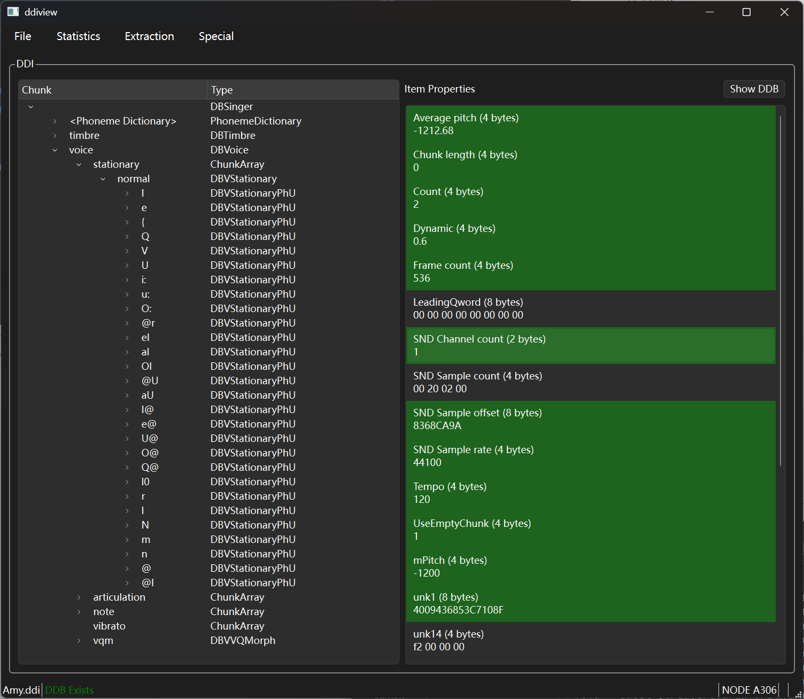

# Daisy Database Viewer

This is a Qt application that visualizes Daisy Database, understanding of the format is mostly based on prior researches and reverse engineering of the program code.

Please build with Qt 6.10. Should work with databases ranging from Version 3 to 5. If a certain database breaks the program, please contact me privately with the database file.

Windows build is tested with Qt 6.10.1 + MSVC2022.
